# Введение

Apache Spark — программный каркас с открытым исходным кодом для реализации распределённой обработки неструктурированных и слабоструктурированных данных, входящий в экосистему проектов Hadoop. В отличие от классического обработчика из ядра Hadoop, реализующего концепцию MapReduce с дисковым вводом и выводом, Spark использует специализируется на обработке в оперативной памяти, благодаря чему позволяет получать значительный выигрыш в скорости работы для некоторых классов задач. В частности, возможность многократного доступа к загруженным в память пользовательским данным делает библиотеку привлекательной для алгоритмов машинного обучения.

Главной абстракцией Spark фреймворка является распределённая коллекция элементов Resilient Distributed Dataset (RDD). К RDD можно применить трансформации (transformation) и действия (action). В первом случае в качестве результата возвращается ссылка на новый RDD, а во втором,  вычисленное значение цепочки трансформаций.

В папке с заданием содержатся следующие наборы данных:
-	книга (warandpeace.txt),
-	https://databank.illinois.edu/datasets/IDB-9610843 выборка данных о поездках такси Нью-Йорка за 2010-2013 годы (nyctaxi.csv),
-	https://www.kaggle.com/benhamner/sf-bay-area-bike-share данные велопарковок Сан-Франциско (trips.csv, stations.csv).

# Цель работы

-	изучить операции загрузки и выгрузки данных в HDFS,
-	ознакомиться с базовыми операциями Apache Spark в spark-shell,
-	создать проект по обработке данных в IDE,
-	отладить анализ данных велопарковок на локальном компьютере,
-	запустить анализ данных велопарковок на сервере.

# Настройка окружения

Скачайте и запустите виртуальную машину с установленными Hadoop и Spark. Например:
-	MapR https://mapr.com/try-mapr/sandbox/,
-	Hortonworks https://www.cloudera.com/downloads/hortonworks-sandbox.html .

Либо, следуя инструкциями в приложении В, запустите Spark кластер в облаке Microsoft Azure.

MapR-FS — API совместимая с HDFS реализация распределённой файловой системы (РФС) от MapR.

Подключитесь к машине по ssh, используя ip или имя узла кластера. Узнать ip адрес виртуальной машины можно выполнив команду ifconfig. В облаке вашей машине присваивается имя, которое вы можете найти на главной странице HDInsight кластера в вкладке Overview.

# Работа в консоли spark-shell

В первой части задания вы работаете с 3 файловыми системами:
-	локальной файловой системой, в которой находятся файлы с заданиями,
-	файловой системой Linux узла кластера, 
-	распределённой файловой системой (краткое описание приведено в приложении А).


## Основные операции взаимодействия с распределённой файловой системой

Для импорта/экспорта данных в РФС используйте команды `hadoop fs –put` и `hadoop fs –get`:
```
$ hadoop fs -put путь-в-локальной-системе путь-в-hdfs

$ hadoop fs -get путь-в-hdfs путь-в-локальной-системе
```
Список остальных команд для взаимодействия с РФС вы можете посмотреть, выполнив hadoop fs без дополнительных ключей. Мы рассмотрим примеры работы с наиболее полезными командами далее.

Переместите необходимые для работы наборы данных в РФС. Для этого сначала скопируйте их в файловую систему узла кластера с помощью команды scp, утилиты WinSCP или плагина NetBox Far менеджера.
```bash
$ scp * mapr@192.168.81.129:~/
mapr@192.168.81.129's password:
list_of_countries_sorted_gini.txt                                 100%  411    14.7KB/s   00:00
nyctaxi.csv                                                       100%   76MB  48.2MB/s   00:01
posts_sample.xml                                                  100%   71MB  49.4MB/s   00:01
programming-languages.csv                                         100%   39KB   9.2MB/s   00:00
stations.csv                                                      100% 5359     1.4MB/s   00:00
trips.csv                                                         100%   37MB  38.8MB/s   00:00
warandsociety.txt                                                 100% 5204KB  55.1MB/s   00:00
```
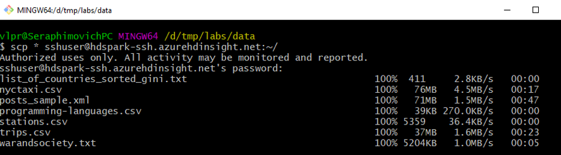

Затем на удалённой машине, находясь в директории с перемещёнными файлами, используйте команду 
```bash
$ hadoop fs -put * .
```
Проверьте, переместились ли файлы.
```bash
$ hadoop fs -ls
```
Следует обратить внимание на то, что в команде не указывалась директория, то есть использовалась директория по умолчанию.

Попробуйте другие команды, например `-mkdir`, `-cat`, `-df`, `-du`. После того как вы освоитесь с перемещением данных в РФС, запустите spark-shell.

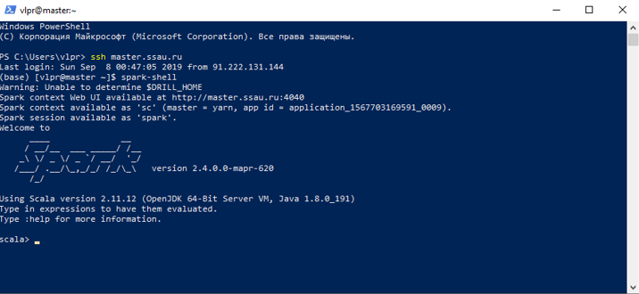

Веб-страница запущенной сессии spark-shell.

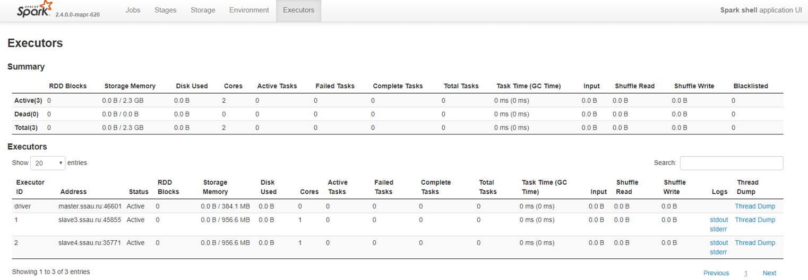

*Примечание.* Попытка привязки веб интерфейса начинается с номера порта 4040 и продолжаются с увеличением на единицу пока не будет найден свободный порт.

Зайдите на веб-страницу менеджера ресурсов YARN. Ваше приложение должно присутствовать в списке в статусе RUNNING. Spark может быть запущен в нескольких режимах: локальном, standalone (собственный менеджер ресурсов), yarn и mesos (внешние менеджеры ресурсов).

В Spark History Server вы можете посмотреть информацию о выполненных Spark задачах.

**Таблица 1. Порты сервисов в виртуальной машине MapR**
| Сервис   | Порт  |
|  :---  | ------------- |
| YARN | 8090 |
| Spark History Server	| 18080 |
| MapR Control System	| 8443 |


## Создание Resilient Distributed Dataset

Создайте RDD для текстового файла warandpeace.txt. Для подробного списка операций считывания файлов обращайтесь к документации класса SparkContext https://spark.apache.org/docs/2.4.0/api/scala/index.html#org.apache.spark.SparkContext.

*Примечание.* При наборе команд используйте TAB $-$ функцию автодополнения.
```scala
val warandpeace = sc.textFile("warandpeace.txt")
```
В данной команде указывается относительный путь, который начинается с вашей папки в РФС.

Выведите количество строк файла.
```scala
warandpeace.count
```
*Примечание.* При отсутствии у функции аргументов, в scala скобки можно опускать.

Попробуйте считать несуществующий файл, например `nil`, а затем вывести количество его строк на экран
```scala
val nilFile = sc.textFile("nil")
nilFile.count
```
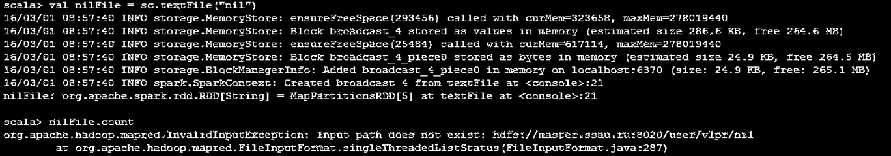

Заметьте, что первая команда выполняется успешно, а вторая выводит сообщение, что такого файла нет. Это происходит потому, что выполнение обработки в Spark является ленивым и не запускается, до встречи команды действия(action). `count` $-$ первая команда действия, с которой вы познакомились.

Считайте первые 10 строк файла warandpeace.txt.
```scala
warandpeace.take(10)
```
Эта команда не требует считывания и передачи на главный узел всех данных RDD.

Узнайте на сколько частей разделились данные в кластере.
```scala
warandpeace.partitions
```
Если используется определённый метод распределения вы можете получить данные о нём командой `partitioner`. Начиная с версии 1.6.0 доступна команда `warAndPeaceFile.getNumPartitions` для получения информации о количестве разделов.

Создайте распределённую коллекцию из нескольких элементов и для каждого элемента верните ip адрес, на котором он расположен:
```scala
sc.parallelize(Array(1,2,3)).map(x => java.net.InetAddress.getLocalHost).collect
```
## Обработка текста

Найдите строки, в которых содержится слово "война".
```scala
val linesWithWar = warandpeace.filter(x => x.contains("война"))
```
*Примечание.* Аргументом filter является лямбда функция $-$ функция без имени.  До обозначения => в скобках через запятую следуют переменные аргументов функции, затем следует команда языка Scala. При использовании фигурных скобок язык позволяет описывать лямбда функции с цепочкой команд в теле, аналогично именованным функциям.

Запросите первую строку. Строкой в данном файле является целый абзац, так как только по завершению абзаца содержится символ переноса строки.
```scala
linesWithWar.first
```
Данные могут быть перемещены в кэш. Этот приём очень полезен при повторном обращении к данным, для запросов "горячих" данных или запуска итеративных алгоритмов.

Перед подсчётом количества элементов вызовите команду кэширования `cache()`. Трансформации не будут обработаны, пока не будет запущена одна из команд - действий.
```scala
linesWithWar.cache()
linesWithWar.count()
linesWithWar.count()
```
Можете воспользовать следующим блоком кода для замера времени выполнения команды.
```scala
def time[R](block: => R): R = {    
	val t0 = System.nanoTime()
    val result = block    // call-by-name
	val t1 = System.nanoTime()
	println("Elapsed time: " + (t1 - t0) + "ns")
	result
}
```

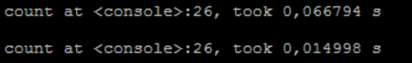

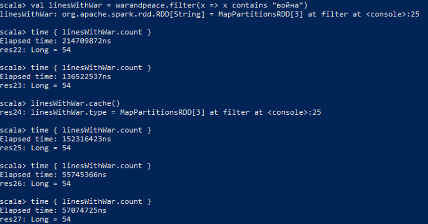


При выполнении команды count второй раз вы должны заметить небольшое ускорение. Кэширование небольших файлов не даёт большого преимущества, однако для огромных файлов, распределённых по сотням или тысячам узлов, разница во времени выполнения может быть существенной. Вторая команда `linesWithWar.count()` выполняется над результатом от предшествующих команде cache трансформаций и на больших объёмах данных будет ускорять выполнение последующих команд.

Найдите гистограмму слов:

```scala
val wordCounts = linesWithWar.flatMap(line => line.split(" ")).map(word => (word, 1)).reduceByKey((a, b) => a + b)
```

Spark существенно упростил реализацию многих задач, ранее решаемых с использованием MapReduce. Эта однострочная программа $-$ WordCount $-$ является наиболее популярным примером задачи, эффективно распараллеливаемой в Hadoop кластере. Её реализация в MapReduce занимается около 130 строк кода.

Сохраните результаты в файл, а затем, найдите данные в HDFS и выведите данные в linux консоли с помощью команды `hadoop fs -cat warandpeace_histogram.txt/*` (здесь используется относительный путь).

```scala
wordCounts.saveAsTextFile("warandpeace_histogram.txt")
```

```bash
$ hadoop fs -cat warandpeace_histogram.txt/*
```

*Упражнение.* Улучшите процедуру, убирая из слов лишние символы и трансформируя все слова в нижний регистр. Используйте регулярные выражения. Например, по регулярному выражению "\\w*".r следующий код

```scala
"\\w*".r.findAllIn("a b c").toArray.foreach(println)
```

выведет на каждой строке по букве. Кроме Scala консоли для тестирования регулярных выражений вы можете использовать сайты:
-	https://regex101.com/,
-	https://www.debuggex.com/.


## Операции с множествами

Инициализируйте два множества


```scala
val a = sc.parallelize(Array(1,2,3,4))
val b = sc.parallelize(Array(3,4,6,7))
```

Найдите объединение a и b и соберите данные на главный узел с помощью функции collect.

```scala
a.union(b).collect
```

Обратите внимание, что общие элементы дублируются, поэтому результат не является классическим множеством на самом деле. Такое поведение делает это операцию очень дешёвой, так как обновляется только информация о местонахождении данных для данного RDD.  Уберите дубликаты с помощью distinct.

```scala
a.union(b).distinct().collect
```

Найдите пересечение множеств.

```scala
a.intersection(b).collect
```

Найдите разность множеств.

```scala
a.subtract(b).collect
```

*Примечание.* При запуске collect на центральный узел - driver передаются все данные из распределённого RDD. При работе с большим объемом данных выполнение данной команды может заполнить всю оперативную память driver узла.

*Упражнение.* Найдите в исходном коде Spark определение функции distinct. Объясните почему реализация этой операции действительно убирает дубликаты.

## Общие переменные

В Apache Spark общими переменными являются широковещательные  (**broadcast**) переменные и аккумулирующие (**accumulator**) переменные.

### Широковещательные переменные

Общие переменные удобны если вы обращаетесь к небольшому объёму данных на всех узлах. Например, это могут быть параметры алгоритмов обработки, небольшие матрицы.

В консоли, с которой вы работали в предыдущем разделе, создайте широковещательную переменную. Наберите:

```scala
val broadcastVar = sc.broadcast(Array(1,2,3))
```

Для получения значения обратитесь к полю value:

```scala
broadcastVar.value
```

### Аккумулирующие переменные

Аккумулирующие переменные являются объектами, которые могут быть изменены только ассоциативной операцией добавления. Они используются для эффективной реализации счётчиков и суммарных значений. Вы можете также использовать свой тип, над котором определена ассоциативная операция при необходимости.  

Особенностью использования переменной является возможность доступа к значению только на узле в driver процессе.

Потренируйтесь в создании аккумулирующих переменных:

```scala
val accum = sc.longAccumulator
```

Следующим шагом запустите параллельную обработку массива и в каждом параллельном задании добавьте к аккумулирующей переменной значение элемента массива:

```scala
sc.parallelize(Array(1,2,3,4)).foreach(x => accum.add(x))
```

Для получения текущего значения вызовите команду:

```scala
accum.value
```

Результатом должно быть число 10.
Пары ключ-значение
Создайте пару ключ-значение из двух букв:

```scala
val pair = ('a', 'b')
```

Для доступа к первому значению обратитесь к полю _1:

```scala
pair._1
```

Для доступа к второму значению к полю _2:

```scala
pair._2
```

Если распределённая коллекция состоит из пар, то они трактуются как для ключ-значение и для таких коллекций доступны дополнительные операции. Наиболее распространённые, это: группировка по ключу, агрегирование значений с одинаковыми ключами, объединение двух коллекций по ключу.

Вы можете выйти из консоли нажатием сочетания клавиш CTRL+D.

К текущему моменту вы познакомились со следующими командами действий: `count`, `first`, `take`, `saveAsTextFile`, `collect`, `foreach`. Полный список команд действий вы можете найти в документации соответствующей версии Spark http://spark.apache.org/docs/latest/rdd-programming-guide.html#actions.

## Топ-10 популярных номеров такси

Проанализируем данные о поездках такси в Нью-Йорке и найдём 10 номеров такси, которые совершили наибольшее количество поездок.

В первую очередь будет необходимо загрузить данные в MapR-FS. Создайте новую папку в MapR-FS:

Создайте RDD на основе загруженных данных nyctaxi.csv:

```scala
val taxi = sc.textFile("nyctaxi.csv")
```

Выведите первые 5 строк из данной таблицы:

```scala
taxi.take(5).foreach(println)
```

Обратите внимание, что первая строка является заголовком. Её как правило нужно будет отфильтровать. Одним из эффективных способов является следующий:

```scala
taxi.mapPartitionsWithIndex{(idx,iter)=> if (idx==0) iter.drop(1) else iter }
```

*Примечание.* Для анализа структурированных табличных данных рассматривайте в качестве альтернативы использование SQL API и DataSet API.

Для разбора значений потребуется создать RDD, где каждая строка разбита на массив подстрок. Используйте запятую в качестве разделителя. Наберите:

```scala
val taxiParse = taxi.map(line=>line.split(","))
```

Теперь преобразуем массив строк в массив пар ключ-значение, где ключом будет служить номер такси (6 колонка), а значением единица.

```scala
val taxiMedKey = taxiParse.map(row => (row(6), 1))
```

Следом мы можем найти количество поездок каждого номера такси:

```scala
val taxiMedCounts = taxiMedKey.reduceByKey((v1, v2) => v1+v2)
```

Выведем полученные результаты в отсортированном виде:

```scala
taxiMedCounts.map(_.swap).top(10).map(_.swap).foreach(println)
```

*Примечание.* Нотация `_.swap` является объявлением анонимной функции от одного аргумента, аналог записи  `x => x.swap`.

Являются ли обе map операции распределёнными? Найдите в документации Spark в классах RDD или PairRDDFunctions метод top.

Вы также можете сгруппировать все описанные выше трансформации, преобразующие исходные данные в одну цепочку:

```scala
val taxiCounts = taxi.map(line=>line.split(",")).map(row=>(row(6),1)).reduceByKey(_ + _)
```

*Примечание.* Нотация `_ + _` является объявлением анонимной функции от двух аргументов, аналог более многословной записи `(a,b) => a + b`.

Попробуйте найти общее количество номеров такси несколько раз, предварительно объявив RDD taxiCounts как сохраняемую в кэше:

```scala
taxiCounts.cache()
```

Сравните время, которое трансформации выполняются первый раз и второй. Чем больше данные, тем существеннее разница.

```scala
taxiCounts.count()
taxiCounts.count()
```

## Настройка способа хранения RDD

В данной части будет рассмотрена настройка способов хранения RDD. Вы сравните различные способы хранения, включая: хранение в сериализованном виде,  в исходном, с репликацией.

```scala
trips.persist(StorageLevel.MEMORY_ONLY)
```

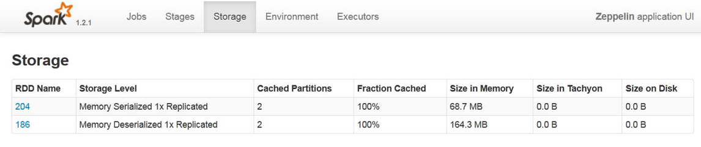

Другими способами хранения являются:

-	MEMORY_AND_DISK,
-	MEMORY_AND_DISK_SER,
-	DISK_ONLY,
-	MEMORY_ONLY_2,
-	MEMORY_AND_DISK_2,
-	OFF_HEAP.

Подробнее о способах хранения вы можете узнать по адресу http://spark.apache.org/docs/latest/programming-guide.html#rdd-persistence


# Создание локального проекта

Разработка программы на Spark может быть выполнена на нескольких языках: Python, R, Scala, Java. В данном руководстве рассмотрим разработку на последних двух, так как они имеют самую полную поддержку API обработки данных.

Разработка приложения может производиться в любом текстовом редакторе, затем быть собрана системой сборки в отдельное приложение и запущена на Spark кластере с помощью консольной команды spark-submit.

В данной лабораторной работе мы будем использовать IntelliJ IDEA. IDE предоставляет набор возможностей для упрощения разработки: автодополнение, индексация проекта, статическая проверка кода, подсветка синтаксиса, интеграция с системами контроля версий и системами сборки.

Для работы необходима установленная последняя версия IDE IntelliJ IDEA Community Edition. Данная среда разработки доступа для скачивания по адресу https://www.jetbrains.com/idea/.

Для создания проекта в IntelliJ IDEA запустите среду разработки, выберите Create New Project.

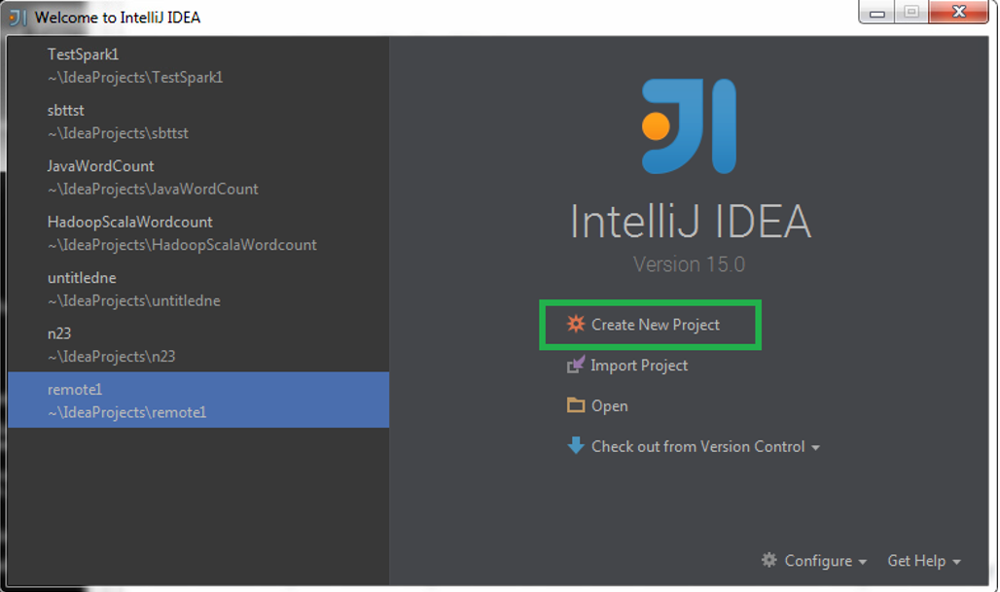
 
## Разработка с использованием системы сборки SBT на языке Scala

Для создания Scala + SBT проекта выберите слева в меню Scala и затем SBT.

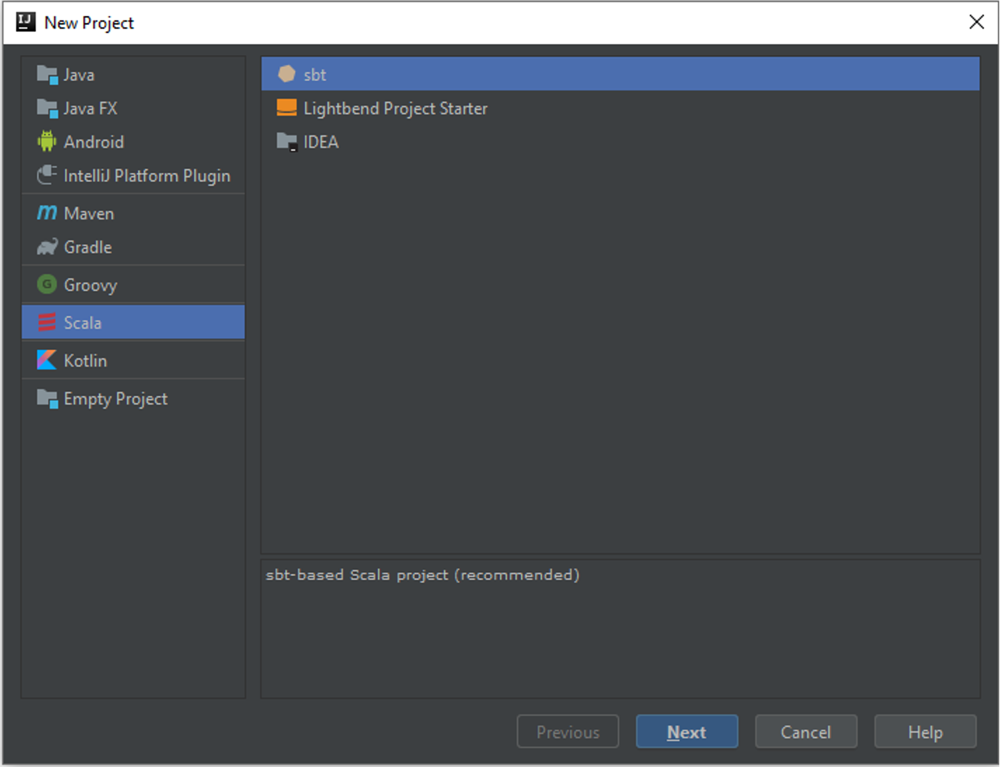

Далее укажите имя проекта, версию Java,  версию SBT и версию Scala компилятора. Для разработки на Spark 2.4.0 рекомендуется выбрать версию Scala 2.12.9.

*Примечание.* Установите флаг Use auto-import для того, чтобы не обновлять зависимости вручную при изменениях в проекте.

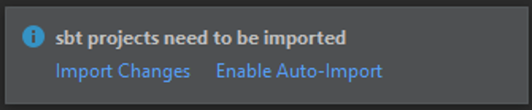

После нажатия Finish откроется главное окно среды разработки.

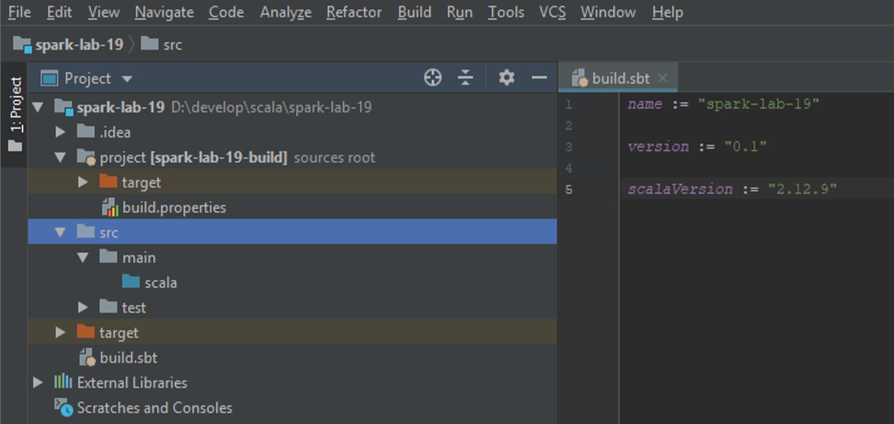

Подождите, когда SBT скачает зависимости.


В дереве проекта должен появиться файл `build.sbt`, являющийся основным файлом для настройки сборки и указания зависимостей проекта SBT. В файле на момент создания указаны: имя проекта, версия проекта, версия языка Scala.

*Примечание.* Появление предупреждений о конфликте имён в SBT 0.13.8 является известной ошибкой https://github.com/sbt/sbt/issues/1933. Одно из  решений — использование более ранней версии или скрытие всех предупреждений установкой степени логирования `logLevel := Level.Error`.


Код Scala помещается в папку `src/main/scala` или `src/main/scala-2.12`.

Создайте в папке scala объект Main c методом main. Данный метод будет точкой входа в программу.

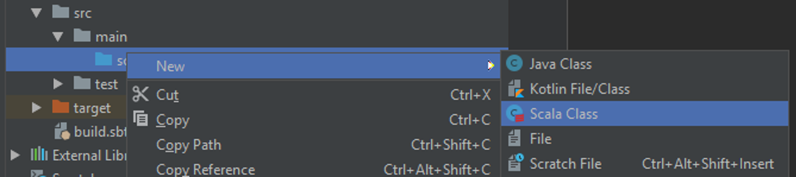
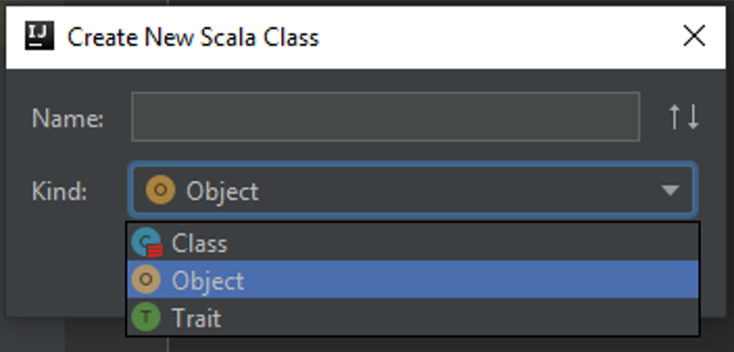

*Примечание.* Аналогом объекта object в Java является паттерн Singleton. Выполнения тела объекта происходит при его загрузке в память, аналогично инициализации в конструкторе, методы object доступны без создания объекта оператором new, аналогично публичным статическим методам.

```scala
object Main {
	def main(args: Array[String]) {
		println("Hello world")
	}
}
```

В контекстном меню выберите Run 'Main', либо нажмите сочетание клавиш Ctrl+Shift+F10.

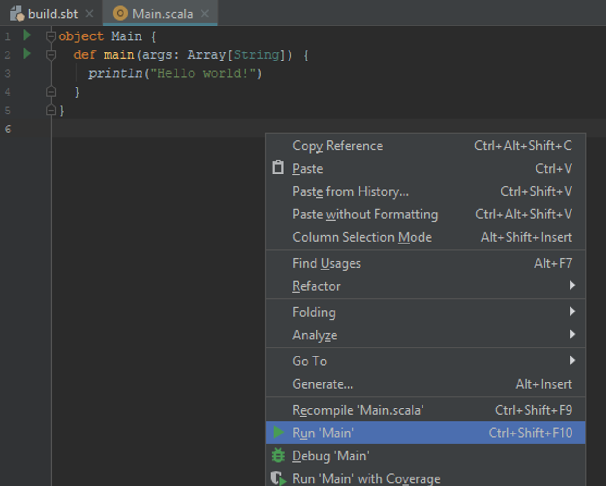

После выполнения в консоли должно появиться приветствие.

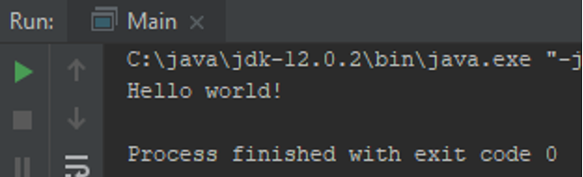

Добавьте к проекту зависимость Spark (версия на MapR кластере), записав следующие строки в конце файла build.sbt:

```scala
libraryDependencies ++= Seq(
	"org.apache.spark" %% "spark-core" % "2.4.0"
)
```

Сохраните изменения и обновите проект.

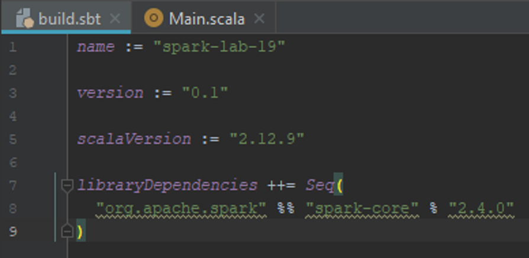

Подождите, когда SBT скачает все зависимые библиотеки.

Измените код `Main.scala` и создайте простейшую Spark программу. Импортируйте классы пакета `org.apache.spark`.

```scala
import org.apache.spark._
```

Создайте конфигурацию Spark с помощью класса SparkConf. Укажите обязательные параметры: имя запускаемой задачи (имя контекста задачи) и режим запуска (список режимов http://spark.apache.org/docs/latest/submitting-applications.html#master-urls). В нашем случае в качестве режима будет указан параметр `local[2]`, означающий запуск с двумя потоками на локальной машине. В качестве режима может быть указан адрес главного узла.

```scala
val cfg = new SparkConf()
          .setAppName("Test").setMaster("local[2]")
```

*Примечание.* В Scala различаются два вида переменных: `val` и `var`. Переменные `val` являются неизменяемыми и инициализируются один раз, в отличие от `var`, которой можно присваивать новые значения несколько раз.

Инициализируйте контекст Spark в главном методе.

```scala
val sc = new SparkContext(cfg)
```

Добавьте в конец файла команду остановки контекста

```scala
sc.stop()
```

После инициализации контекста вы можете обращаться к командам Spark. Считайте любой текстовый файл из локальной файловой системы и выведите его по строкам в консоль.

*Примечание.* Путь к файлу в локальной файловой системе имеет определённый формат, имеющий префикс "file:///". https://tools.ietf.org/html/rfc8089

```scala
val textFile = sc.textFile("file:///c:/temp/file.txt")
textFile.foreach(println)
```

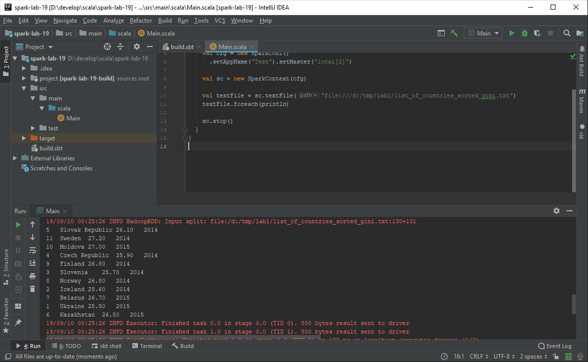

*Примечание.* При работе без winutils.exe запись в файловую систему будет порождать ошибку. Известным решением является скачивание данного файла из проекта Hadoop в файловую систему в папку с названием bin и указанием переменной Spark `hadoop.home.dir`. В переменной `hadoop.home.dir`  хранится путь к папке c Hadoop определённой версии. Установить переменную среды JVM вы можете кодом `System`.`setProperty(key, value)` . Другим решением проблемы является установка переменной среды `HADOOP_HOME` (потребуется перезапуск IDE). https://issues.apache.org/jira/browse/SPARK-2356.

## Анализ данных велопарковок

Тестовыми данными являются список поездок на велосипедах `trips.csv` и список велостоянок проката велосипедов `stations.csv`.

 

Создайте по одному RDD на основе каждого файла `stations.csv`, `trips.csv`. Считайте данные в переменную, затем запомните заголовок. Объявите новую переменную с данными, в которых не будет заголовка, а строки преобразованы в массивы строк в соответствии с разделителем — запятая.

*Примечание.* Существует более эффективный, но громоздкий способ исключить заголовок из данных с использованием метода mapPartitionWithIndex. Пример присутствует в первой части лабораторной работы в разделе нахождения десяти популярных номеров такси.

```scala
val tripData = sc.textFile("file:///z:/data/trips.csv")

// запомним заголовок, чтобы затем его исключить
val tripsHeader = tripData.first
val trips = tripData.filter(row=>row!=tripsHeader)
		  .map(row=>row.split(",",-1))

val stationData = sc.textFile("file:///z:/data/stations.csv")
val stationsHeader = stationData.first
val stations = stationData.filter(row=>row!=stationsHeader)                                    			.map(row=>row.split(",",-1))
```

*Примечание.* Использование в качестве второго параметра -1 в `row.split(",",-1)` позволяет не отбрасывать пустые строки. Например `"1,2,".split(",")` вернёт `Array("1","2")`, а `"1,2,".split(",",-1)` вернёт `Array("1","2","")`.

Выведите заголовки таблиц и изучите колонки csv файлов.

```scala
stationsHeader
tripsHeader
```

Выведите несколько элементов данных в trips и stations.

*Примечание.* Убрать информационные строки логов из выдачи можно следующим образом:

```scala
import org.apache.log4j.{Logger, Level}
Logger.getLogger("org.apache.spark").setLevel(Level.WARN)
Logger.getLogger("org.spark-project").setLevel(Level.WARN)
```

Объявите `stationsIndexed` так, чтобы результатом был список пар ключ-значение с целочисленным ключом  из первой колонки.  Таким образом вы создаёте индекс на основе первой колонки - номера велостоянки

```scala
val stationsIndexed = stations.keyBy(row=>row(0).toInt)
```

*Примечание.* Обращение к массиву в Scala производится в круглых скобках. Например Array(1,2,3)(0) вернёт первый элемент.

Выведите часть данных нового RDD.

Аналогичное действие проделайте для индексирования коллекции trips по колонкам Start Terminal и  End Terminal и сохраните результат в переменные, например tripsByStartTerminals и tripsByEndTerminals.

Выполните операцию объединения коллекций по ключу с помощью функции join. Объедините stationsIndexed и tripsByStartTerminals, stationsIndexed и tripsByEndTerminals.

```scala
val startTrips = stationsIndexed.join(tripsByStartTerminals)
val endTrips = stationsIndexed.join(tripsByEndTerminals)
```

Объявление последовательности трансформаций приводит к созданию ацикличного ориентированного графа. Вывести  полученный граф можно для любого RDD.

```scala
startTrips.toDebugString
endTrips.toDebugString
```
 
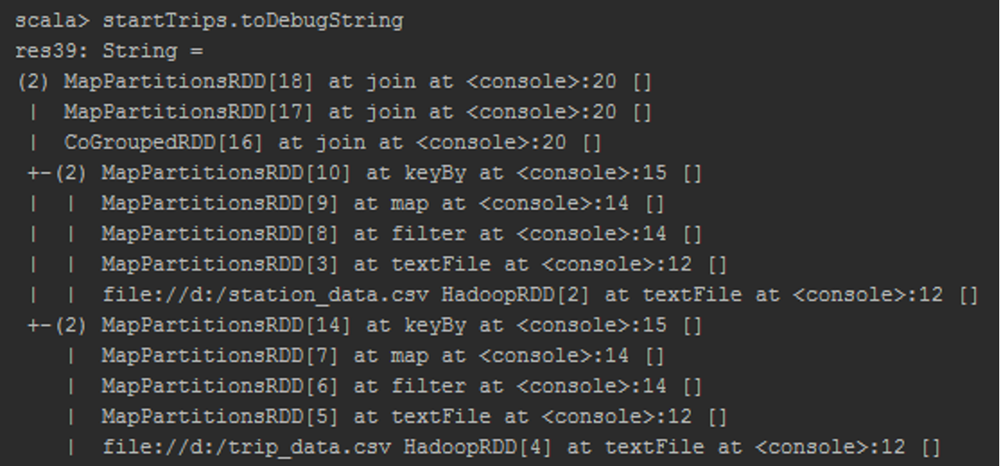


Выполните  объявленные графы трансформаций вызовом команды count.

```scala
startTrips.count()
endTrips.count()
```

Если вы знаете распределение ключей заранее, вы можете выбрать оптимальный способ хеширования ключей по разделам `Partition`. Например, если один ключ встречается на порядки чаще, чем другие ключи, то использование `HashPartitioner` будет не лучшим выбором, так как данные связанные с этим ключом будут собираться в одном разделе. Это приведёт к неравномерной нагрузке на вычислительные ресурсы.

Выбрать определённую реализацию класса распределения по разделам можно с помощью функции RDD `partitionBy`. Например, для RDD `stationsIndexed`  выбирается `HashPartitioner` с количеством разделов равным количеству разделов trips RDD.

```scala
stationsIndexed.partitionBy(new HashPartitioner(trips.partitions.size))
```

Также можно создавать свои классы для распределения ключей. Узнать какой класс назначен для текущего RDD можно обращением к полю partitioner.

```scala
stationsIndexed.partitioner
```

## Создание модели данных

Для более эффективной  обработки и получения дополнительных возможностей мы можем объявить классы сущностей предметной области и преобразовать исходные строковые данные в объявленное представление.

В Scala часто для объявления структур данных используется конструкция case class. Особенностью такого объявления класса являются: автоматическое создание методов доступа get для аргументов конструктора, автоматическое определение методов hashcode и equals, возможность case классов быть разобранными по шаблону (pattern matching). Например, для определения

```scala
case class IntNumber(val value:Integer)
```

выполнение

```scala
new IntNumber(4).value
```

вернёт значение 4.

Объявите case классы для представления строк  таблиц в соответствии с именами заголовков.

```scala
case class Station(
  stationId:Integer,
  name:String,
  lat:Double,
  long:Double,
  dockcount:Integer,
  landmark:String,
  installation:String,
  notes:String)

case class Trip(
  tripId:Integer,
  duration:Integer,
  startDate:LocalDateTime,
  startStation:String,
  startTerminal:Integer,
  endDate:LocalDateTime,
  endStation:String,
  endTerminal:Integer,
  bikeId: Integer,
  subscriptionType: String,
  zipCode: String)
```

Для конвертации времени будем использовать пакет java.time. Краткое введение в работу с пакетом находится в Приложении Б. Объявим формат данных.

```scala
val timeFormat = DateTimeFormatter.ofPattern("M/d/yyyy H:m")
```

Объявим trips с учётом преобразования во внутреннее представление.

```scala
val tripsInternal = trips.mapPartitions(rows => {
  val timeFormat = DateTimeFormatter.ofPattern("M/d/yyyy H:m")
  rows.map( row =>
    new Trip(tripId=row(0).toInt,
      duration=row(1).toInt,
      startDate= LocalDate.parse(row(2), timeFormat),
      startStation=row(3),
      startTerminal=row(4).toInt,
      endDate=LocalDate.parse(row(5), timeFormat),
      endStation=row(6),
      endTerminal=row(7).toInt,
      bikeId=row(8).toInt,
      subscriptionType=row(9),
      zipCode=row(10)))})
```

Изучите полученные данные. Например, вызовом следующих команд:

```scala
tripsInternal.first
tripsInternal.first.startDate
```

*Примечание.* В связи с тем, что timeFormat содержит несериализуемый объект, его необходимо создавать на каждом узле для каждой партиции.

То же можно проделать и для station RDD

```scala
val stationsInternal = stations.map(row=>
	new Station(stationId=row(0).toInt,
                name=row(1),
                lat=row(2).toDouble,
                long=row(3).toDouble,
                dockcount=row(4).toInt,
                landmark=row(5),
                installation=row(6)
                notes=null))
```

*Примечание.* Восьмая колонка не присутствует в таблице, так как в данных она пустая. Если в будущем она не будет использоваться, имеет смысл её убрать из описания case класса.

*Примечание.* В данных присутствуют различные форматы времени.

Посчитаем среднее время поездки, используя  groupByKey.

Для этого потребуется преобразовать trips RDD в RDD коллекцию пар ключ-значение аналогично тому, как мы совершали это ранее методом keyBy.

```scala
val tripsByStartStation = tripsInternal.keyBy(record => record.startStation)
```

Рассчитаем среднее время поездки для каждого стартового парковочного места

```scala
val avgDurationByStartStation = tripsByStartStation
 .mapValues(x=>x.duration)
 .groupByKey()
 .mapValues(col=>col.reduce((a,b)=>a+b)/col.size)
```

Выведем первые 10 результатов

```scala
avgDurationByStartStation.take(10).foreach(println)
```

Выполнение операции groupByKey приводит к интенсивным передачам данных. Если группировка делается для последующей редукции элементов лучше использовать трансформацию reduceByKey или aggregateByKey. Их выполнение приведёт сначала к локальной редукции над разделом Partition, а затем будет произведено окончательное суммирование над полученными частичными суммами.

*Примечание.* Выполнение reduceByKey логически сходно с выполнением Combine и Reduce фазы MapReduce  работы.

Функция aggregateByKey является аналогом reduceByKey с возможностью указывать начальный элемент.

Рассчитаем среднее значение с помощью aggregateByKey. Одновременно будут вычисляться два значения для каждого стартового терминала: сумма времён и количество поездок.

```scala
val avgDurationByStartStation2 = tripsByStartStation
  .mapValues(x=>x.duration)
  .aggregateByKey((0,0))(
   (acc, value) => (acc._1 + value, acc._2 + 1),
   (acc1, acc2) => (acc1._1+acc2._1, acc1._2+acc2._2))
  .mapValues(acc=>acc._1/acc._2)
```

В первых скобках передаётся начальное значение. В нашем случае это пара нулей. Первая анонимная функция предназначена для прохода по коллекции раздела. На этом проходе значение элементов помещаются средой в переменную value, а переменная «аккумулятора» acc накапливает значения. Вторая анонимная функция предназначена для этапа редукции частично посчитанных локальных результатов.

Сравните результаты `avgDurationByStartStation` и `avgDurationByStartStation2` и их время выполнения.

Теперь найдём первую поездку для каждой велостоянки. Для решения опять потребуется группировка. Ещё одним недостатком `groupByKey` данных является то, что для группировки данные должны поместиться в оперативной памяти. Это может привести к ошибке `OutOfMemoryException` для больших объёмов данных.

Сгруппируем поездки по велостоянкам и отсортируем поездки в группах по возрастанию даты.

```scala
val firstGrouped = tripsByStartStation
  .groupByKey()
  .mapValues(x =>
    x.toList.sortWith((trip1, trip2) =>
      trip1.startDate.compareTo(trip2.startDate)<0))
```

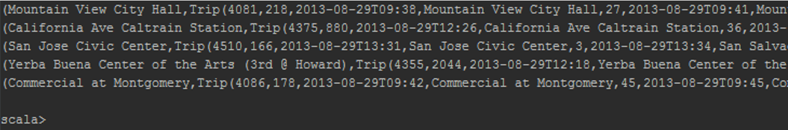

Лучшим вариантом с точки зрения эффективности будет использование трансформации reduceByKey

```scala
val firstGrouped = tripsByStartStation
  .reduceByKey((trip1,trip2) =>
    if (trip1.startDate.compareTo(trip2.startDate)<0)
    trip1 else trip2)
```

В данном случае «передаваться дальше» будет меньшее из значений ключа.

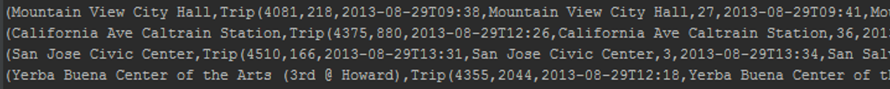

## Задачи:

1.	Найти велосипед с максимальным пробегом.
2.	Найти наибольшее расстояние между станциями.
3.	Найти путь велосипеда с максимальным пробегом через станции.
4.	Найти количество велосипедов в системе.
5.	Найти пользователей потративших на поездки более 3 часов.

## Запуск проекта в кластере

Для запуска собранного проекта на сервере используйте команду `spark-submit`. Однако прежде чем собрать проект, необходимо его изменить, так как в данный момент в коде зашиты пути к файлам с данными в локальной системе и режим запуска (`setMaster(“local[2]“)`).

Параметризуйте эти значения аргументами передаваемыми в программу при запуске.

```scala
val Seq(masterURL, tripDataPath, stationDataPath) = args.toSeq
val cfg = new SparkConfig().setAppName("Test").setMaster(masterURL)

val tripData = sc.textFile(tripDataPath)
val stationData = sc.textFile(stationDataPath)
```

В конфигурации запуска добавьте значения аргументов:


Проверьте, что проект работает на локальном компьютере.

Соберите JAR с помощью sbt команды package. Файл появится в директории `target/scala-2.12`. Скопируйте его на сервер с помощью `scp` и запустите.

```
$ spark-submit --deploy-mode cluster untitled4_2.11-0.1.jar yarn /labs/lab1/trips.csv /labs/lab1/stations.csv
```

Логи YARN контейнеров вы можете найти в директории `/mapr/tmp/studX/`. Проверьте, что выдача вашей программы на сервере идентична выдаче в IDE при запуске на локальном компьютере.


# Приложение А
## Краткое описание файловой системы HDFS

HDFS — распределенная файловая система, используемая в проекте Hadoop. HDFS-кластер в первую очередь состоит из NameNоde-сервера и DataNode-серверов, которые хранят данные. NameNode-сервер управляет пространством имен файловой системы и доступом клиентов к данным. Чтобы разгрузить NameNode-сервер, передача данных осуществляется только между клиентом и DataNode-сервером.


Развёртывание экземпляра HDFS предусматривает наличие центрального узла имён (англ. name node), хранящего метаданные файловой системы и метаинформацию о распределении блоков, и серии узлов данных (англ. data node), непосредственно хранящих блоки файлов. Узел имён отвечает за обработку операций уровня файлов и каталогов — открытие и закрытие файлов, манипуляция с каталогами, узлы данных непосредственно отрабатывают операции по записи и чтению данных. Узел имён и узлы данных снабжаются веб-серверами, отображающими текущий статус узлов и позволяющими просматривать содержимое файловой системы. Административные функции доступны из интерфейса командной строки.

# Приложение Б
## Основные понятия java.time

Для представления времени в Java 8 рекомендуется использовать пакет `java.time`, реализующий стандарт JSR 310. Документация пакета `java.time` доступна по адресу https://docs.oracle.com/javase/8/docs/api/java/time/package-summary.html.  

Далее приводится работа с основными классами представления времени `java.time`. Для экспериментов удобно использовать REPL консоль. Если вы находитесь в среде разработки IDEA Scala консоль может быть запущена нажатием Ctrl+Shift+D, либо через контекстное меню Intellij IDEA.

Примечание. REPL (от сокращения `read`, `eval`, `print`, `loop` - считать, выполнить, напечатать, повторять в цикле)  интерактивный цикл взаимодействия программной среды с пользователем.

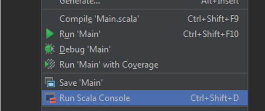
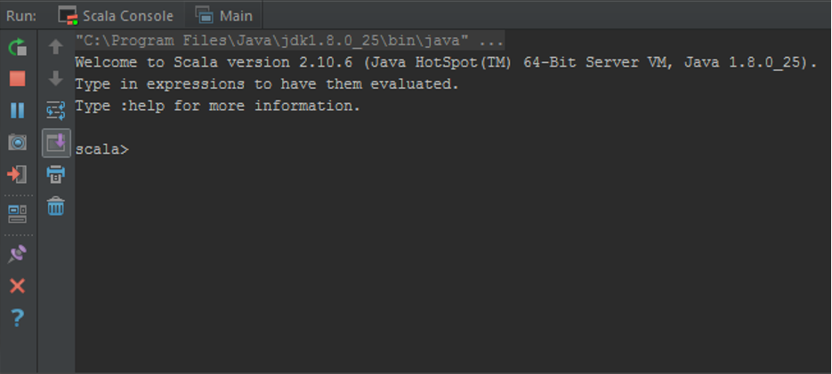
 
Примечание. Консоль также можно запустить в командном окне операционной системы с помощью sbt console, находясь в папке с проектом. В обоих вариантах зависимости проекта подключаются автоматически так, что вы можете работать со сторонними библиотеками.

В пакете java.time различаются представления времени:
-	класс Instant — хранит числовую метку;
-	класс LocalDate — хранит дату без времени;
-	класс LocalTime — хранит время без даты;
-	класс LocalDateTime — хранит время и дату;
-	класс ZonedDateTime — хранит дату, время и часовой пояс.

Узнайте в консоли текущее время, вызвав статический метод now() у каждого класса, изучите возвращаемое представление. Например,

``` scala
import java.time._
Instant.now()
```

Перед  использованием классов объявите их импорт. Символ «_» импортирует все классы данного пакета.

Enter используется для переноса строки.  Для выполнения нажмите сочетание клавиш Ctrl+Enter.

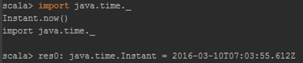

Создайте примечательную вам дату с помощью статического конструктора of классов `LocalDate`, `LocalDateTime`, `ZonedDateTime`. Воспользуйтесь подсказками среды разработки или документацией для определения количества аргументов метода of и их значения.


Изучите создание времён и дат с помощью метода parse данных классов. Используйте форматирование, которое выдавалось системой при возвращении значения в консоль.

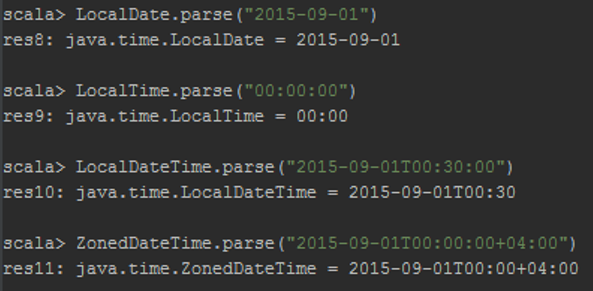

Для задания пользовательского формата считывания вы можете использовать класс DateTimeFormatter. Описание класса и символов шаблона располагается по адресу https://docs.oracle.com/javase/8/docs/api/java/time/format/DateTimeFormatter.html.
