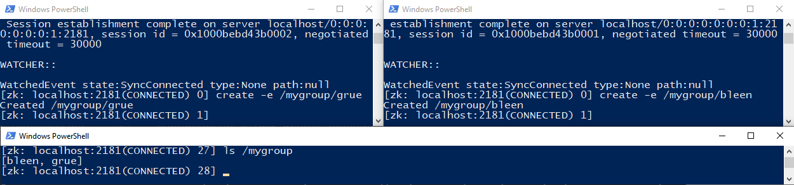
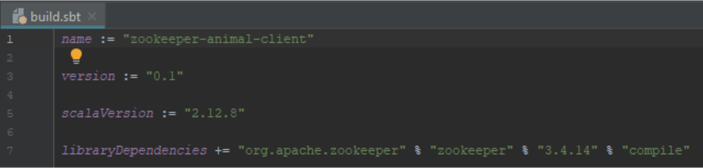
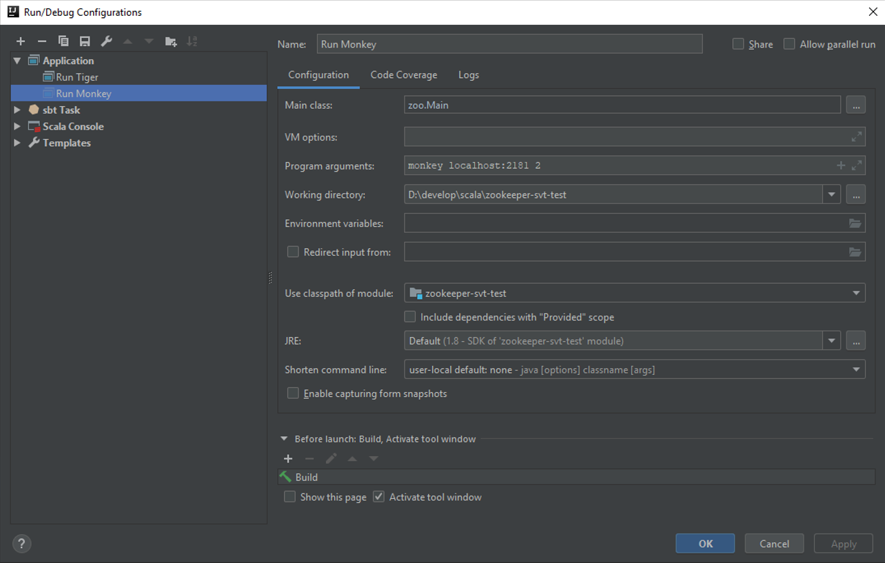

# Введение

Крупномасштабным распределённым приложениям требуются различные формы синхронизации для достижения консенсуса о базовой информации окружения. Выделение примитивов синхронизации в API позволяет выделить ядро координации из логики приложения в отдельный сервис. Являясь частью критической инфраструктуры, к такому сервису предъявляются в первую очередь требования надёжности и доступности. Подобный дизайн делает разработку и поддержку распределённого приложения проще.

ZooKeeper является проектом с открытым исходным кодом, который предоставляет отказоустойчивый распределённый сервис хранения критичных для работы кластера данных. Хранимыми данными могут быть: конфигурационная информация, иерархическое пространство имён, url ссылки, идентификаторы задач и прочее. ZooKeeper, созданный для внутренних нужд компании Yahoo!”, в настоящее время стал использоваться такими открытыми технологиями, как: Apache HBase, HDFS, Apache Storm, Apache Kafka и др.

Сайт проекта http://zookeeper.apache.org/.   
Статья: Hunt P. et al. ZooKeeper: Wait-free Coordination for Internet-scale Systems //USENIX annual technical conference. – 2010. – Т. 8. – №. 9. 

 
# Цель работы

-	запустить ZooKeeper,
-	изучить директорию с установкой ZooKeeper,
-	запустить интерактивную сессию ZooKeeper CLI и освоить её команды,
-	научиться проводить мониторинг ZooKeeper,
-	разработать приложение с барьерной синхронизацией, основанной на ZooKeeper,
-	запустить и проверить работу приложения.

Данная лабораторная может выполняться на виртуальной машине создаваемой по Vagrant конфигурации в приложении А или с ZooKeeper, установленным в Windows. 

 
# Изучение ZooKeeper
## Установка

Данный шаг может быть пропущен, если вы будете работать с Vagrant.

Перейдите на страницу Download на официальном сайте https://zookeeper.apache.org/ и скачайте последнюю стабильную версию (на момент написания 3.4.14). 

Архив содержит скрипты как для Windows, так и для Unix операционных систем. Необходимым условием для работы Zookeeper является наличие в системе Java Runtime Environment.

Распакуйте архив в директорию `С:\Temp` в Windows. Если вы используете Unix систему, распакуйте и переместите содержимое архива в `/opt`. Набор команд, устанавливающих ZooKeeper в CentOS 7, вы можете найти в Vagrantfile из приложения А.

Перед первым запуском переименуйте файл `zoo_sample.cfg` в директории `conf` в `zoo.cfg`. Файл `zoo.cfg`, который на данный момент содержит базовые настройки, используется для конфигурации сервера.

*Примечание.* В Windows системе в `Панель управления\Система и безопасность\Система -> Дополнительные параметры системы -> Переменные среды` можно установить `JAVA_HOME`, если она не была сконфигурирована вами или администратором после установки Java в систему.

## Запуск
### Windows
В Windows запустите сервер двойным кликом по скрипту `zkServer.cmd` в папке `./bin/` или из терминала, набрав:

```
zkServer.cmd 
```

### Linux

```
zkServer.sh 
```

Проверьте, что zookeeper работает

```
systemctl status zookeeper
```

## Изучение директории установки ZooKeeper

Перейдите в директорию установки ZooKeeper.

Изучите содержимое директории.

 

В директории находятся следующие папки:

-	bin с исполняемыми файлами для запуска, остановки и взаимодействия с ZooKeeper,
-	conf с конфигурационными файлами,
-	contrib с инструментами для интеграции ZooKeeper в другие системы: rest, fuse, perl и python библиотеки,
-	dist-maven артефакты Maven,
-	docs в которой хранится документация,
-	recipes различные рецепты, помогающие решать задачи с использованием ZooKeeper (выбор лидера, блокировки, очереди),
-	src с исходным кодом и тестовыми скриптами.

## Взаимодействие с ZooKeeper через командный интерфейс CLI

Одним из способов взаимодействия с ZooKeeper является консольный интерфейс ZooKeeper CLI. В реальных задачах вы скорее всего будете использовать ZooKeeper клиентскую библиотеку, однако взаимодействие через CLI является прекрасной возможностью изучить систему и также полезно для ряда задач. 

Прежде всего нам понадобится перейти в папку bin директории установки ZooKeeper. 

Для запуска интерактивной сессии ZooKeeper CLI используйте скрипт zkCli с расширением в зависимости от той среды, в который вы его запускаете (sh - unix, cmd - windows).

 

Следующая команда устанавливает подключение к ZooKeeper CLI сессии:
```
./zkCli.sh -server 127.0.0.1:2181
```
 

*Примечание.* При запуске zkCli.sh без параметров по умолчанию подключение производится к localhost:2181, поэтому явно указанные выше параметры вы можете опустить.

Подключение установлено. Для вывода всех возможных команд наберите help.

```
[zk: localhost:2181(CONNECTED) 0] help
ZooKeeper -server host:port -client-configuration properties-file cmd args
        addWatch [-m mode] path # optional mode is one of [PERSISTENT, PERSISTENT_RECURSIVE] - default is PERSISTENT_RECURSIVE
        addauth scheme auth
        close
        config [-c] [-w] [-s]
        connect host:port
        create [-s] [-e] [-c] [-t ttl] path [data] [acl]
        delete [-v version] path
        deleteall path [-b batch size]
        delquota [-n|-b|-N|-B] path
        get [-s] [-w] path
        getAcl [-s] path
        getAllChildrenNumber path
        getEphemerals path
        history
        listquota path
        ls [-s] [-w] [-R] path
        printwatches on|off
        quit
        reconfig [-s] [-v version] [[-file path] | [-members serverID=host:port1:port2;port3[,...]*]] | [-add serverId=host:port1:port2;port3[,...]]* [-remove serverId[,...]*]
        redo cmdno
        removewatches path [-c|-d|-a] [-l]
        set [-s] [-v version] path data
        setAcl [-s] [-v version] [-R] path acl
        setquota -n|-b|-N|-B val path
        stat [-w] path
        sync path
        version
        whoami
```

Выйти из консоли вы можете с помощью команды quit или отправив EOF символ сочетанием Ctrl+D.

Далее последует изучение возможностей CLI интерфейса. Вы научитесь добавлять и удалять разные типы узлов znode, считывать и записывать данные в znode из CLI, разбираться в управлении конфигурациями на базовых примерах.

Находясь в консоли CLI введите команду `ls /`.

```
[zk: localhost:2181(CONNECTED) 2] ls /
[zookeeper]
```

В результе вы должны получить список узлов в корне иерархической структуры данных ZooKeeper. В данном случае выводится один узел. Аналогично вы можете изучать некорневые узлы. Выведите список дочерних узлов `/zookeeper`. 

*Примечание.* Используйте автоматическое дополнение при наборе, срабатываемое по нажатию клавиши TAB.

Теперь в корне создайте свой узел `/mynode` с данными "first_version" следующей командой:
```
create /mynode 'first_version'
```
Проверьте, что в корне появился новый узел.

```
[zk: localhost:2181(CONNECTED) 4] ls /
[mynode, zookeeper]
```

Следующие команды возвращают данные и метаданные узла:
```
get /mynode
stat /mynode
```

```
[zk: localhost:2181(CONNECTED) 10] get /mynode
first_version

[zk: localhost:2181(CONNECTED) 13] stat /mynode
cZxid = 0x2
ctime = Wed Sep 01 10:51:29 SAMT 2021
mZxid = 0x2
mtime = Wed Sep 01 10:51:29 SAMT 2021
pZxid = 0x2
cversion = 0
dataVersion = 0
aclVersion = 0
ephemeralOwner = 0x0
dataLength = 13
numChildren = 0
```

Изучим структуру, хранимую в узле

|Поле	| Описание |
| ----| ----|
|'first_version'|	Хранимые данные|
|cZxid|	Номер транзакции создания узла в системе|
|ctime|	Время создания узла|
|mZxid|	Номер транзакции модификации узла|
|mtime|	Время модификации узла|
|pZxid|	Номер транзакции модификации дочерних узлов|
|cversion|	Количество изменений дочерних узлов|
|dataVersion|	Количество изменений данных узла|
|aclVersion|	Количество изменений прав доступа к данному узлу|
|ephemeralOwner|	Идентификатор сессии владельца узла, если узел эфимерный. Иначе значение равно нулю.|
|dataLength|	Размер данных|
|numChildren|	Количество дочерних узлов|

Измените данные узла на "second_version":
```
set /mynode 'second_version'
```

```
[zk: localhost:2181(CONNECTED) 15] get /mynode
second_version

[zk: localhost:2181(CONNECTED) 16] stat /mynode
cZxid = 0x2
ctime = Wed Sep 01 10:51:29 SAMT 2021
mZxid = 0x3
mtime = Wed Sep 01 10:56:11 SAMT 2021
pZxid = 0x2
cversion = 0
dataVersion = 1
aclVersion = 0
ephemeralOwner = 0x0
dataLength = 14
numChildren = 0
```

В качестве результата мы получим обновлённые метаданные узла. Обратите внимание на те значения, которые изменились.

Изменилась дата модификации `mtime` и значение поля `dataVersion` стало больше на единицу, так как мы провели одно изменение.  Также изменился размер данных.

Теперь создайте два нумерованных (sequential) узла в качестве дочерних mynode:
```
create -s /mynode/child 'im_sequential'
create -s /mynode/child 'me_too'
```
 
```
[zk: localhost:2181(CONNECTED) 17] create -s /mynode/child 'im_sequential'
Created /mynode/child0000000000
[zk: localhost:2181(CONNECTED) 18] create -s /mynode/child 'me_too'
Created /mynode/child0000000001
```

Передав дополнительно флаг -s, мы указали, что создаваемый узел нумерованный. Этот способ позволяет создавать узлы с уникальными именами, по которым можно узнать порядок поступления запросов на сервер.

*Пример.* Принадлежность клиентов к группе

Несмотря на то, что ZooKeeper используется, как правило, из программного кода, мы можем эмулировать простой сценарий мониторинга принадлежности клиентов к группе в CLI.

В данном примере в корне zookeeper файловой системы будет создан узел под именем mygroup. Затем несколько сессий CLI будут эмулировать клиентов, добавляющих себя в эту группу. Клиент будет добавлять эфимерный узел в mygroup иерархию. При закрытии сессии узел автоматически будет удаляться.

*Примечание.* При использовании Vagrant управляемой виртуальной машины из VisualCode создайте несколько терминалов и установите ssh соединение в каждом командой `vagrant ssh`.

Этот сценарий может применяться для реализации сервиса разрешения имён (DNS) узлов кластера. Каждый узел регистрирует себя под своим именем и сохраняет свой url или ip адрес. Узлы, которые временно недоступны или аварийно завершили работу, в списке отсутствуют. Таким образом директория хранит актуальный список работающих узлов с их адресами. 

Внутри CLI сессии, создайте узел mygroup.

```
create /mygroup 'top_node'
```

Откройте две новых CLI консоли и в каждой создайте по дочернему узлу в mygroup:

*Примечание.* Удобный способ открыть CLI консоль в windows `Shift + Правая кнопка мыши -> Открыть окно PowerShell здесь` в директории zookeeper, затем выполнить `bin/zkCli.cmd`.

Консоль 1 - grue.
```
create -e /mygroup/grue 'iam_grue'
```
Консоль 2 - bleen.
```
create -e /mygroup/bleen 'iam_bleen'
```
Эфимерный тип узла задаётся ключом `-e`. 

Проверьте в исходной консоли, что grue и bleen являются членами группы mygroup.  


 

Представим теперь, что одному из клиентов нужна информация о другом клиенте (к качестве клиентов могут выступать узлы кластера). Этот сценарий эмулируется получением информации командой `get`, которую мы уже  запускали ранее. Выберите консоль grue и обратитесь к информации узла bleen.

```
get /mygroup/bleen
```

Информацией, которая хранится в узле клиента может быть url адрес клиента, либо любая другая информация требуемая для работы распределённого приложения.

Теперь эмулируйте аварийное отключение любого клиента. Нажмите сочетание клавиш Ctrl+D в одной из консолей, создавшей эфимерный узел.

Проверьте, что соответствующий узел пропал из mygroup. Изменение списка дочерних узлов может произойти не сразу — от 2 до 20 `tickTime`, значение которого вы можете посмотреть в `zoo.cfg`.

```
[zk: localhost:2181(CONNECTED) 53] ls /mygroup
[bleen, grue]
[zk: localhost:2181(CONNECTED) 54] ls /mygroup
[bleen, grue]
[zk: localhost:2181(CONNECTED) 55] ls /mygroup
[bleen, grue]
[zk: localhost:2181(CONNECTED) 56] ls /mygroup
[bleen, grue]
[zk: localhost:2181(CONNECTED) 57] ls /mygroup
[bleen, grue]
[zk: localhost:2181(CONNECTED) 58] ls /mygroup
[bleen, grue]
[zk: localhost:2181(CONNECTED) 59] ls /mygroup
[bleen, grue]
[zk: localhost:2181(CONNECTED) 60] ls /mygroup
[bleen]
[zk: localhost:2181(CONNECTED) 61]
```

Таким образом клиенты могут получать информацию о появлении и отключении других клиентов. 

В заключении удалите узел `/mygroup`.

```
delete /mygroup
```

### Пример управления конфигурацией распределённого приложения

Хранение конфигурационной информации в ZooKeeper одно из наиболее популярных приложений. Мы будем эмулировать данную концепцию также с помощью CLI. 

Использование ZooKeeper для хранения конфигурационной информации имеет два преимущества. Первое состоит в том, что новые клиенты могут узнавать конфигурацию кластера и определять свою роль самостоятельно. Второе преимущество заключается в возможности подписки на обновление конфигурационных параметров. Это позволяет динамически реагировать на изменения в конфигурации во время выполнения, что необходимо в режиме работы 24/7.

Создадим в корне узел "myconfig" в задачу которого будет входить хранение конфигурации. В нашем случае узел будет хранить строку `'sheep_count=1'`.

 

Во всех случаях, когда конфигурационная информация нашего гипотетического распределённого приложения будет изменяться, мы будем обновлять znode строкой с новым значением. Другим клиентам распределённого приложения достаточно проверять хранимые в этом узле данные.

Откройте новую консоль и подключитесь к ZooKeeper. Данная консоль будет играть роль физического сервера, который ожидает получить оповещение в случае изменения конфигурационной информации, записанной в `/myconfig` znode.


Следующая команда устанавливает watch-триггер на узел:

```
get /myconfig -w true
```

Вернитесь к первому терминалу и измените значение myconfig:

```
set /myconfig 'sheep_count=2'
```

Во втором терминале должно появиться оповещение об изменении данных!

```
[zk: localhost:2181(CONNECTED) 87]
WATCHER::

WatchedEvent state:SyncConnected type:NodeDataChanged path:/myconfig
```

Триггер сбрасывается после одного срабатывания, а значит его придётся 'взводить' каждый раз заново. Как правило, в приложении, в логике обработчика события присутствует такая процедура.

Удалите узел `/myconfig`. Проверьте, что эта команда выполнилась.

Примеры приложений:
-	Эфимерные узлы в сочетании возможностью быть нумерованными позволяют реализовать механизм аварийного переключения https://ru.wikipedia.org/wiki/Аварийное_переключение, производить выбор лидера, обеспечивать координацию доступа к ресурсам. 
-	Асинхронная передача и рассылка сообщений.

Другие примеры использования ZooKeeper  https://zookeeper.apache.org/doc/r3.4.5/recipes.html.


## Мониторинг ZooKeeper

ZooKeeper позволяет проводить мониторинг его состояния с использованием 4 буквенных команд: `conf`, `cons`, `stat` и других. Полный список команд доступен по адресу https://zookeeper.apache.org/doc/trunk/zookeeperAdmin.html#The+Four+Letter+Words. 

**Примечание. В последних версиях Zookeeper 4-буквенные команды отключены по умолчанию. Вы можете их включить при запуске сервера с параметром JVM `-Dzookeeper.4lw.commands.whitelist=*`.**

Команды можно отправлять на сервер из linux терминала с помощью утилит `echo` и `netcat`. Для некоторых linux систем `netcat` может быть вызван по сокращённому имени `nc`. Синтаксис команды:

```
echo <команда> | nc <имя или адрес хоста zookeeper> <порт>
```

В Windows вы можете установить подключение к zookeeper командой telnet

```
telnet <имя или адрес хоста zookeeper> <порт>
```

Для следующей команды сервер должен прислать ответ "imok", если он функционирует и доступен:

```
echo ruok | nc localhost 2181 
```

Узнать версию zookeeper позволяет следующая команда:

```
echo stat | nc localhost 2181
```

Следующая команда возвращает конфигурационные параметры ZooKeeper сервера:

```
echo conf | nc localhost 2181
```
 

После выполнения распечатываются следующие параметры: 
-	порт клиента (`clientPort`), 
-	путь к директории, где хранятся данные (`dataDir`),
-	путь к директории, где хранятся логи сервера (`dataLogDir`),
-	интервал часов, указанный миллисекундах (`tickTime`),
-	максимальное количество подключений к серверу (`maxClientCnxns`),
-	минимальный и максимальный таймаут сессии (`minSessionTimeout`, `maxSessionTimeout`),
-	идентификатор сервера.

Вышеперечисленные параметры могут быть указана в конфигурационном файле в директории conf (полный путь `/opt/ibm/biginsights/zookeeper/conf/`).

Отправьте команду `cons` для получения списка подключений всех клиентов с детальной информацией о сессиях. 

```
echo cons | nc localhost 2181
```
 

Команды cons и conf дают детальную информацию. Для получения более общей информации используйте stat.

```
echo stat | nc localhost 2181
```
 

В распределённом варианте работы ZooKeeper команду dump для вывода текущих сессий и связанных с ними эфимерных узлов следует выполнять на узле-лидере. В текущей лабораторной работе все данные будут связаны с локально выполняемыми клиентскими процессами.

```
echo dump | nc localhost 2181
```
 

Для того, чтобы посмотреть информацию о watch-триггерах используйте команду wchs:

```
echo wchs | nc localhost 2181
```
 

Существуют и другие команды, найти которые вы можете в документации по администрированию ZooKeeper (Administrator's Guide).

На этом первая часть работы завершена.
 
# Разработка распределённого приложения

ZooKeeper поставляется с двумя клиентами для языков C и Java. В текущей лабораторной мы будем использовать Java API для реализации приложения с барьерной синхронизацией. Аналогия с животными и зоопарком позволит  лучше понять концепты ZooKeeper. 

Вы создадите зоопарк, который будет представлен корневым узлом `/zoo/`. Каждое животное, ваше приложение, будет входить в зоопарк, оно будет создавать дочерний эфимерный узел в зоопарке со своим именем. После того, как все животные будут в сборе, каждое начнёт бежать и остановится через определённый период времени. В конце приложения эфимерные узлы будут явно удалены.

## Настройка среды и проекта

Разработка распределённого приложения будет вестись на языке Scala в IDE IntelliJ Idea. 

Создайте новый проект SBT аналогично тому, как это делалось в лабораторной работе 4. Дождитесь когда SBT инициализирует проект. Это может занять несколько минут.

Добавьте в качестве зависимости библиотеку ZooKeeper в `build.sbt` как `provided`. Определите версию ZooKeeper.  Координаты библиотеки соответствующей версии вы можете найти в https://mvnrepository.com/.



*Примечание.* При указании zookeeper зависимости может потребоваться исключения из зависимостей: `com.sun.jdmk`, `com.sun.jmx`, `javax.jms`. 

## Реализация логики приложения

Инициализируйте пакет `zoo` в папке `src/main/scala/`.

В пакете `zoo` создайте scala объект `Main` и поместите туда следующий код.

```scala
package zoo

object Main {
  val sleepTime = 100

  def main(args: Array[String]): Unit = {
    println("Starting animal runner")

    val Seq(animalName, hostPort, partySize) = args.toSeq

    val animal = Animal(animalName, hostPort, "/zoo", partySize.toInt)

    try {
      
    } catch {
      case e: Exception => println("Animal was not permitted to the zoo. " + e)
    }
  }
}
```

Этот код объявляет главный класс с методом `main`. Программа ожидает в качестве аргументов список: имя животного, адрес и порт zookeeper, размер группы животных. Далее следует создание объекта `Animal` на основе параметров: имя животного, адрес и порт zookeeper, путь к корневому узлу для узлов животных, величина группы животных. В конце метода main располагается try/catch блок, в котором будет выполняться код взаимодействующий с ZooKeeper.

*Примечание.* Приём, с помощью которого присваиваются списку имён переменных соответствующие значения списка аргументов, называется "сопоставление по шаблону" (pattern matching).

Нашей следующей задачей будет реализация класса `Animal` и заполнение тела try блока. 

В методе enter объект `Animal` должен связываться с ZooKeeper, создавать эфимерный узел с именем `animalName` и подписываться на обновления группы `/zoo`. 

```scala
animal.enter()
println(s"${animal.name} entered.")
```

Напишите цикл, в котором с интервалом sleepTime в миллисекундах печатается сообщение о работе процесса. Количество итераций может быть случайным.

```scala
for (i <- 1 to Random.nextInt(100)) {
   Thread.sleep(sleepTime)
   println(s"${animal.name} is running...")
}

animal.leave()
```

Перейдём к реализации класса Animal. Для удобства обращения к полям класса будем использовать case class. Инициализация Animal заключается в установлении соединения с ZooKeeper, определении переменных mutex и animalPath. 

```scala
package zoo

import org.apache.zookeeper._

case class Animal(name:String, hostPort:String, root:String, partySize:Integer) extends Watcher {
  val zk = new ZooKeeper(hostPort, 3000, this)
  val mutex = new Object()
  val animalPath = root+"/"+name

  if (zk == null) throw new Exception("ZK is NULL.")
}
```

Для реакции на события от ZooKeeper класс должен реализовывать метод process интерфейса Watcher. 

```scala
override def process(event: WatchedEvent): Unit = {
  // код реакции на событие
}
```

Так как обработка событий и проверка условия барьера выполняются в разных потоках нам понадобится выполнять код методов в синхронизованном блоке. Синхронизация в Scala похожа на Java и выполняется на объекте-мьютексе. Ниже приведён пример блока синхронизации.

```scala
mutex.synchronized {
  // код       
}
```

Реализуем простую реакцию $-$ вывод на экран события. 

```scala
override def process(event: WatchedEvent): Unit = {
  mutex.synchronized {
    println(s"Event from keeper: ${event.getType}")
  }
}
```

Далее перейдём к реализации метода enter. 

```scala
def enter():Boolean = {
  // код создания узла и ожидания у барьера
}
```

В начале метода создайте эфимерный узел.

```scala
zk.create(animalPath, Array.emptyByteArray, ZooDefs.Ids.OPEN_ACL_UNSAFE, CreateMode.EPHEMERAL)
```

Затем в синхронизованном блоке в цикле напишите код, ожидающий появления в корневом узле `/zoo` всех животных.

```scala
mutex.synchronized {
  while (true) {
    val party = zk.getChildren(root, this)
    if (party.size() < partySize) {
       println("Waiting for the others.")
       mutex.wait()
       println("Noticed someone.")
     } else {
       return true
     }
   }
  }
  return false
}
```

Реализуйте оставшийся метод, который вызывается в конце приложения и удаляет созданный в начале эфимерный узел с помощью метода `delete`.

## Проверка работоспособности приложения

Запустите несколько клиентов распределённого приложения и проверьте его работу.

 

*Примечание.* Перед запуском создайте корневой узел животных `/zoo`, если он ещё не создан.

*Примечание.* Убедитесь, что библиотеки, которые используются проектом (zookeeper, log4j и другие) находятся в области видимости `CLASSPATH`. Окружения этапов компиляции, тестирования и исполнения как правило различны.

## Упражнения

С использованием Zookeeper сервиса:

1. Решите проблему обедающих философов (каждый философ - отдельный процесс в системе)
2. Реализуйте двуфазный коммит протокол для high-available регистра (каждый регистр - отдельный процесс в системе)


# Приложение А. Инициализация виртуальной машины с помощью Vagrant

Для работы Vagrant необходим гипервизор Oracle VM VirtualBox. Для инициализации виртуальной машины поместите следующие файлы в пустую папку, находясь в ней откройте терминал и запустите команду `vagrant up`.

Vagrantfile
```Vagrantfile
# -*- mode: ruby -*-
# vi: set ft=ruby :


# All Vagrant configuration is done below. The "2" in Vagrant.configure
# configures the configuration version (we support older styles for
# backwards compatibility). Please don't change it unless you know what
# you're doing.
Vagrant.configure("2") do |config|
# The most common configuration options are documented and commented below.
# For a complete reference, please see the online documentation at
# https://docs.vagrantup.com.


# Every Vagrant development environment requires a box. You can search for
# boxes at https://vagrantcloud.com/search.
config.vm.box = "centos/7"
# config.vm.provider "virtualbox" do |vb|
# # Display the VirtualBox GUI when booting the machine
# vb.gui = true
#
# # Customize the amount of memory on the VM:
# vb.memory = "1024"
# end
#
# View the documentation for the provider you are using for more
# information on available options.


# Enable provisioning with a shell script. Additional provisioners such as
# Puppet, Chef, Ansible, Salt, and Docker are also available. Please see the
# documentation for more information about their specific syntax and use.
config.vm.provision "file", source: "zookeeper.service", destination: "zookeeper.service"
config.vm.provision "shell", inline: <<-SHELL
yum install nc -y
yum install java-11-openjdk -y
yum install wget -y
wget http://apache-mirror.rbc.ru/pub/apache/zookeeper/zookeeper-3.4.14/zookeeper-3.4.14.tar.gz
tar zxf zookeeper-3.4.14.tar.gz
mv zookeeper-3.4.14 /opt/
cp /opt/zookeeper-3.4.14/conf/zoo_sample.cfg /opt/zookeeper-3.4.14/conf/zoo.cfg
mv zookeeper.service /etc/systemd/system/zookeeper.service
chmod 664 /etc/systemd/system/zookeeper.service
systemctl start zookeeper
SHELL
end

zookeeper.service

[Unit]
Description=Zookeeper
After=syslog.target
 
[Service]
SyslogIdentifier=zookeeper
TimeoutStartSec=10min
Type=forking
ExecStart=/opt/zookeeper-3.4.14/bin/zkServer.sh start
ExecStop=/opt/zookeeper-3.4.14/bin/zkServer.sh stop
 
[Install]
WantedBy=multi-user.target
```

# Дополнительные ссылки 

1. https://www.youtube.com/c/DistributedSystemsCourse
2. https://www.youtube.com/c/lindseykuperwithasharpie
3. https://lamport.azurewebsites.net/video/videos.html (recent talk: https://www.youtube.com/watch?v=Ocxczi-CvRQ)
4. https://hydraconf.com/ (free talks: https://www.youtube.com/channel/UCcwI0q9tsGZYZDvz5mLsXZA)
5. Lynch, Nancy A. Distributed Algorithms. 1996. https://dl.acm.org/doi/book/10.5555/2821576
6. Martin Kleppmann. Designing Data-Intensive Applications: The Big Ideas Behind Reliable, Scalable, and Maintainable Systems
7. Alex Petrov. Database Internals: A Deep Dive Into How Distributed Data Systems Work. 